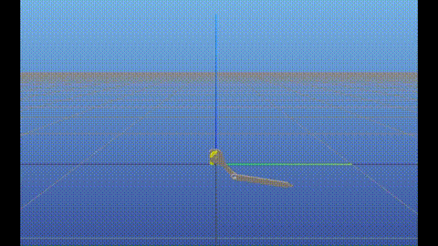

# Final Project - Optimal Control Value Function Approximation
Alejandro Enrique Barbi & Alessandro Moscatelli

---

The aim of this project is to learn an approximate value function, to be used as terminal cost in an
Model Predictive Control (MPC) formulation. In particular, the objective of this report is to verify that
an MPC with horizon $M$ and terminal cost $l_F$, trained on data generated with horizon $N$, can achieve
performance comparable to that of an MPC controller with horizon $M + N$.

### How to run the code

To run this code, type on the terminal:

```[bash]
python3 main.py --sim <n> --save <folder_name> --load_data_path <path> --load_model_path <path>
```

Parameters do the following:
- `--sim`: Number of simulations executed to generate performance statistics.
- `--save`: Name of the output directory where result plots and figures are saved.
- `--load_data_path`: Path from which the dataset (.npz file) is loaded. If not specified, it defaults to `model_<pendulum_name>`.
- `--load_model_path`: Path from which the trained PyTorch model (.pt file) is loaded. If not specified, it defaults to  `model_<pendulum_name>`.

All remaining parameters, including cost weights, neural network architecture, training settings, and model parameters—are defined in the `config.py` file.

### Video Demo

<p align="center">
  
</p>